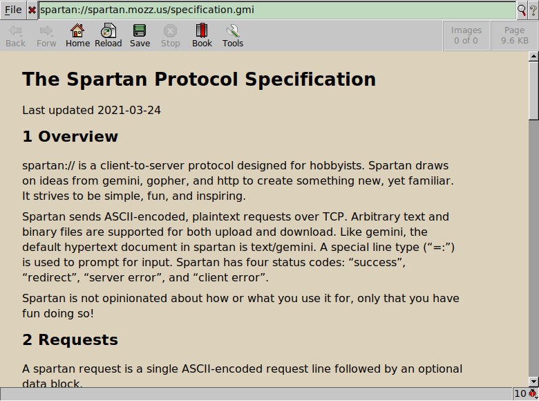

# Spartan plugin for Dillo

[Spartan][] protocol plugin for [Dillo][] written in Bash.



To install use:

```sh
make install
```

Some sites to try:

- <spartan://mozz.us>
- <spartan://tilde.team>
- <spartan://tilde.cafe>

[Spartan]: https://portal.mozz.us/spartan/spartan.mozz.us/
[Dillo]: https://dillo-browser.github.io/

GPLv3 licensed.
